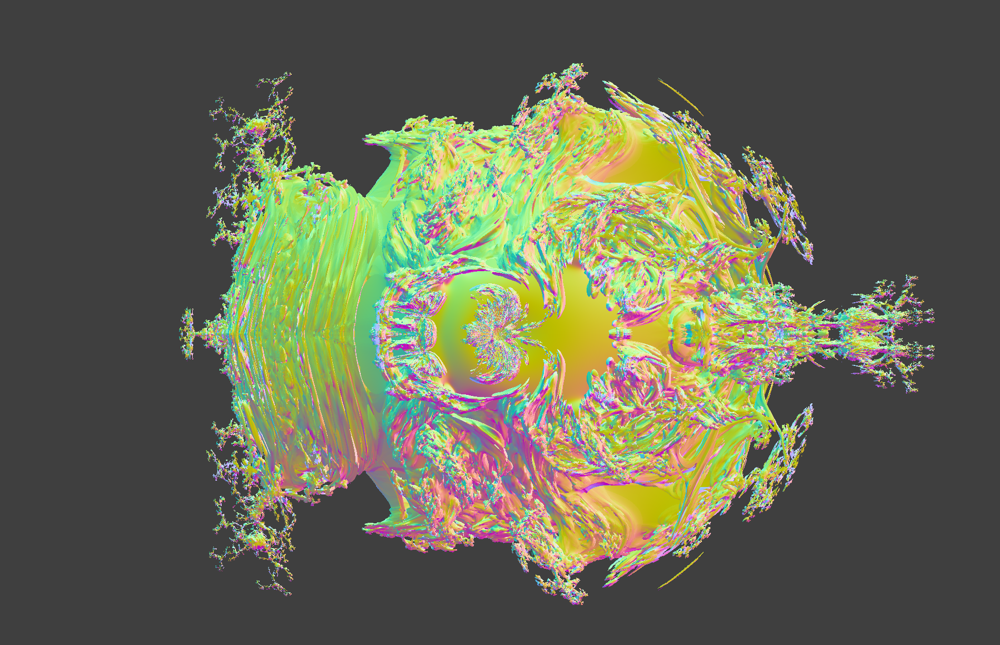
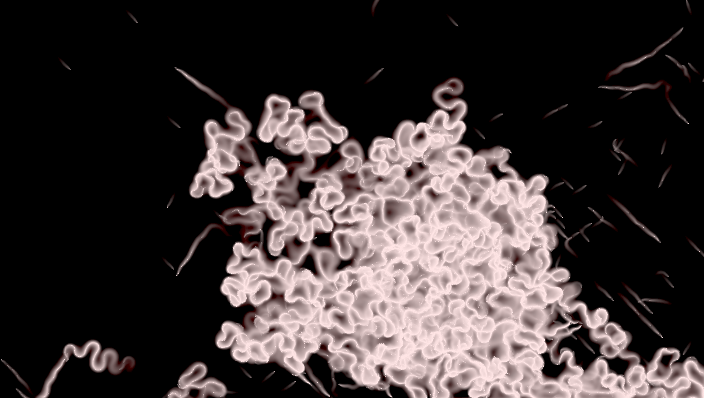
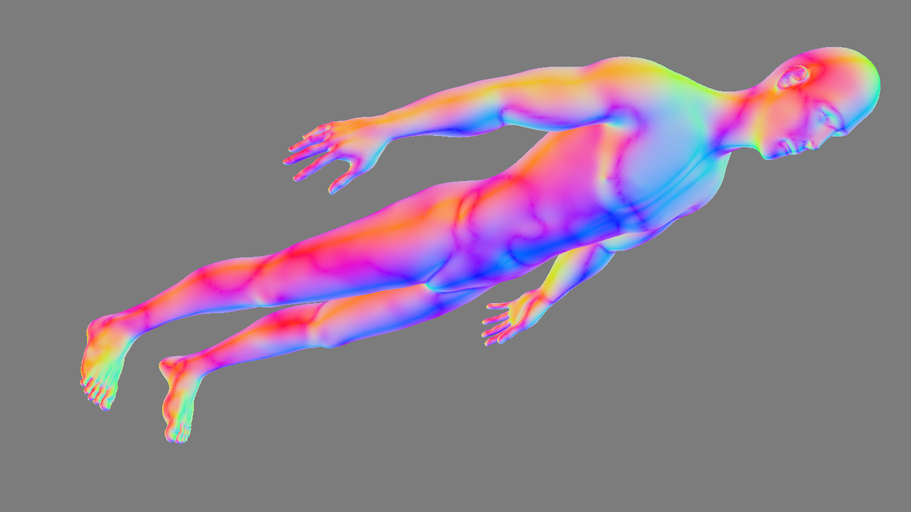
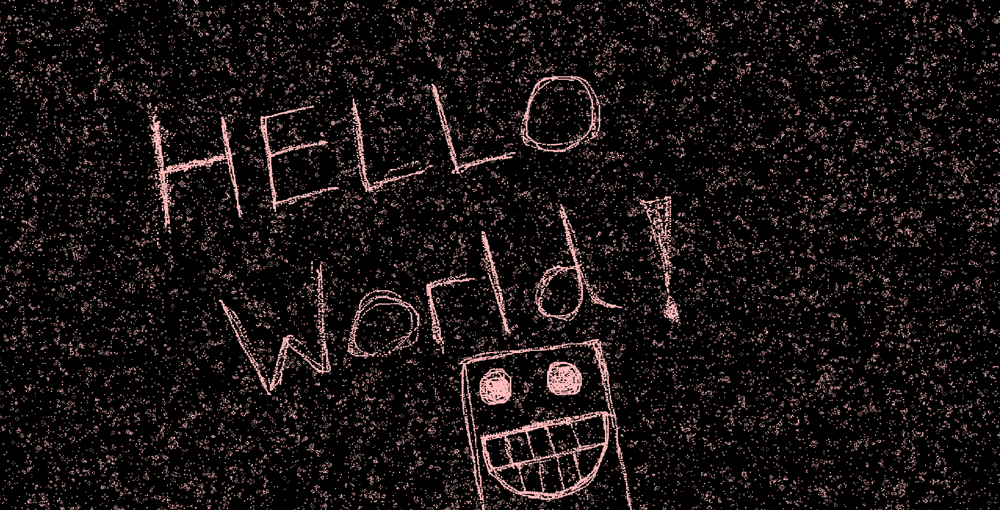

# Vulkan Wrapper

A basic wrapper around Vulkan, allowing for (reasonably) swift development of vulkan apps

### The wrapper supports:

- Basic 2D and 3D graphics (with depth buffers)
- Programmable Frag and Vertex Shaders
- Programmable Compute Shaders
- Multiple stages of pipelines (see Slime Mold App)
- Push Constants
- Uniform Buffers
- Buffer Addresses (via push constants)

In the development of an app, the `VulkanRoot` object exposes various references to its lower level objects

This allows custom control over the creation of objects at run time such as new buffers, or updating existing ones

The VulkanWrapper contains an `ImplementationHelp` namespace which may contain some handy objects/functions to make your VulkanApp neater/concise

## Software Architecture

### VulkanRoot

```cpp
struct VulkanRoot {
  run_app(VulkanAppInterface&) -> std::expected<void, std::string>
  run_frame(VulkanAppTickState&) -> std::expected<void, std::string>
  recreate_swap_chain() -> std::expected<void, std::string>
  end_glfw_instance() -> void;
  ...
  GlfwWindow;
  VulkanInstanceAndSurface;
  DeviceAndQueueContainer;
  SwapchainInfoContainer;
  DebuggerContainer;
  DepthBufferContainer;
};
```

This VulkanRoot contains all the information that is shared across many different vulkan apps

### VulkanApp

```cpp
struct VulkanAppInterface {
  is_running() -> bool
  get_current_state() -> std::expected<std::optional<VulkanAppTickState>, std::string>
};
```

An app to be used by the Vulkan Renderer must implement this interface

### VulkanAppTickState

```cpp
struct VulkanAppTickState {
  vk::raii::Fence &fence_ref;
  vk::raii::Semaphore &present_complete_sem_ref;
  vk::raii::Semaphore &render_finished_sem_ref;

  uint32_t current_frame_index;
  uint32_t current_image_index;

  vk::SubmitInfo queue_submit_info;
};
```

### Example Usage

```cpp
VulkanRoot vulkan{..initialised..};
MandelbulbApp app1{..initialised..};

std::expected<void, string> success = vulkan.run_app(chosen_app);
```

```cpp
VulkanRoot::run_app(App& app) {
  while (app.is_running() and glfwWindowRunning) {
    poll_glfw_events()

    current_state = app.get_current_state()
    .. validate it ..

    if (swapchain needs recreating) {
      recreate_swap_chain()
    }

    run_frame(current_state)

    .. confirm success ..
  }
}
```

# Example Apps

## Animated Mandelbulb

A Simple raymarching app with a Mandelbulb MSD, which is animated via a 'sin()' power



## Slime Simulation

1920x1080 Simulation featuring a 2-stage compute pipeline (one for the mesh, one for the slime 'agents'), and a graphics pipeline to render it. Roughly 1 million Slime Agents



## 3D Object Loader

A simple app which utilises tinyobj (packed in its app folder) to display the provided .obj file



## Conways Game of Life App

1920x1080 Simulation with random points initialised. Also, a drawing feature was implementing with Pause/Play


